# ElectroCasa — Plataforma de Datos en Azure Databricks

Proyecto integrador de Data Engineering para centralizar seis fuentes heterogéneas de una cadena ficticia de electrodomésticos y construir una solución gobernada, trazable y desplegable sobre Azure Databricks.

**Resultado final:** pipeline Medallion `Bronze → Silver → Gold`, orquestación con Lakeflow Jobs, seguridad con Unity Catalog, monitoreo con Event Log y despliegue mediante Databricks Asset Bundles en `dev` y `prod`.

---

## 1. Arquitectura y decisiones principales

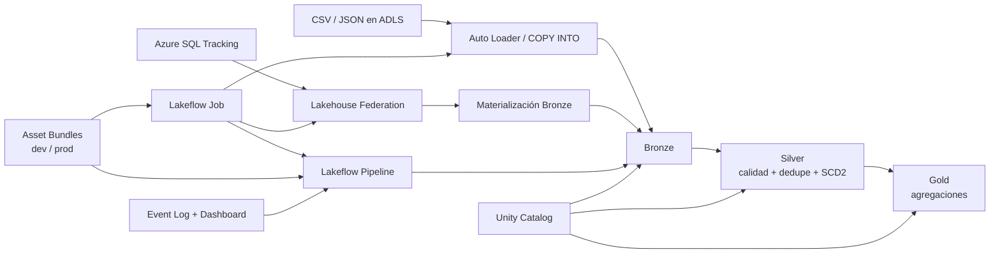

### Decisiones justificadas

| Decisión | Sustento |
|---|---|
| **Medallion** | Separa ingesta raw, limpieza/calidad e indicadores de negocio. Facilita trazabilidad y evita mezclar reglas técnicas con reglas de consumo. |
| **External Volume para landing** | Los archivos fuente tienen ciclo de vida independiente del pipeline y deben existir fuera de las tablas. |
| **Managed tables para Bronze/Silver/Gold** | El pipeline administra su ciclo de vida; Unity Catalog simplifica ownership, permisos y limpieza. |
| **Serverless** | El workload es intermitente y la suscripción tenía restricciones de cuota para compute clásico. Evita clusters ociosos y simplifica aprovisionamiento. |
| **Auto Loader en modo directory listing** | Managed File Events no pudo habilitarse por permisos Azure faltantes. Para el volumen del ejercicio, directory listing es suficiente. |
| **Schedule finalmente PAUSED** | El trigger fue configurado y probado, pero se deja pausado para evitar ejecuciones/costo innecesario durante la entrega. |

---

## 2. Fuentes e ingesta

| Fuente | Patrón | Método | Por qué |
|---|---|---|---|
| Ventas CSV | Diaria / incremental | Auto Loader | Procesa nuevos archivos sin releer manualmente todo el landing. |
| Productos JSON | Snapshot de baja frecuencia | COPY INTO | Batch simple e idempotente; una segunda ejecución del mismo archivo no duplica filas. |
| Empleados CSV | Eventos por lote | Auto Loader | Permite incorporar nuevos lotes y luego historizarlos. |
| Reseñas JSON | Incremental / semiestructurado | Auto Loader | Adecuado para nuevos archivos y estructuras anidadas. |
| Devoluciones CSV | Diaria / incremental | Auto Loader | Mismo patrón incremental que Ventas. |
| Tracking Azure SQL | Bajo volumen / bajo demanda | Lakehouse Federation + materialización | Acceso gobernado sin credenciales hardcodeadas y desacople posterior del origen. |

Para Auto Loader, cada fuente usa `cloudFiles.schemaLocation` bajo el Volume. No se usa almacenamiento efímero del cluster para el esquema.

Tracking se consulta mediante:

```text
Azure Key Vault → Secret Scope → Unity Catalog Connection → Foreign Catalog
→ electrocasa_sql_catalog.dbo.trackingenvios
→ electrocasa_<ambiente>.bronze.tracking_envios
```

Las credenciales `sql-user` y `sql-password` se consumen desde `electrocasa-secrets`; nunca se imprimen ni se hardcodean.

---

## 3. Bronze, Silver y calidad

### Bronze

Todas las fuentes conservan el dato lo más fiel posible y agregan auditoría (`fec_ingesta`, origen/archivo e `id_lote`). Volúmenes observados:

| Fuente | Filas Bronze |
|---|---:|
| Ventas | 15,225 |
| Productos | 3,030 |
| Empleados | 4,078 |
| Reseñas | 8,080 |
| Devoluciones | 4,040 |
| Tracking | 5,050 |

### Silver y cuarentena

Se aplican casts, normalización, deduplicación, detección de huérfanos y reglas de calidad.

| Dominio | Regla crítica | Política elegida | Resultado |
|---|---|---|---:|
| Ventas | `monto_total > 0` | DROP de Silver válida + cuarentena | 14,140 válidas / 860 cuarentena |
| Reseñas | `calificacion BETWEEN 1 AND 5` | DROP + cuarentena | 7,856 válidas / 144 cuarentena |
| Devoluciones | `monto_reembolso >= 0` | DROP + cuarentena | 3,931 válidas / 69 cuarentena |

**Por qué DROP + cuarentena y no FAIL:** son errores a nivel de fila que afectarían métricas, pero no justifican detener toda la carga diaria. Los registros inválidos se excluyen del dataset confiable y permanecen consultables para auditoría.

### Empleados — SCD Tipo 2

Se implementa AUTO CDC con SCD Tipo 2 porque transferencias y cambios salariales deben conservar el valor anterior.

Se usa `id_empleado` como clave de negocio, no `dni`, porque el profiling mostró DNI nulos, compartidos y cambios de DNI entre eventos. Para no inventar una secuencia temporal:

- 46 eventos sin fecha → cuarentena.
- 28 eventos del mismo empleado en la misma fecha → cuarentena por ambigüedad.
- 74 eventos no historizables de forma confiable.

Resultado: **3,816 versiones**, **1,995 empleados historizados** y **1,888 activos**.

---

## 4. Gold — resultados y evidencias

Se implementaron cuatro agregaciones, superando el mínimo de tres.

### Ventas por sucursal y mes

`gold.ventas_sucursal_mes` calcula ventas, monto y ticket promedio. La validación confirma que Gold conserva exactamente las ventas y monto válidos de Silver.

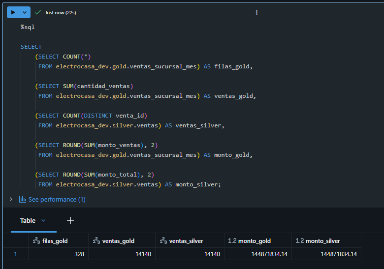

### Productos vendidos vs devueltos

`gold.productos_ventas_devoluciones` consolida unidades vendidas y devoluciones sin fanout en el join.

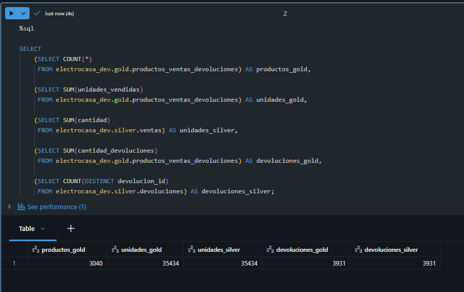

### Dotación activa por sucursal

`gold.dotacion_sucursal` usa las versiones vigentes del SCD2 (`__END_AT IS NULL`).

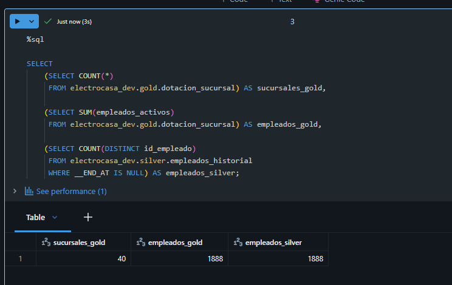

### Reseñas negativas por categoría

`gold.resenas_categoria` considera negativa una calificación `<= 2`; productos huérfanos se agrupan como `sin_categoria` para no perder trazabilidad.

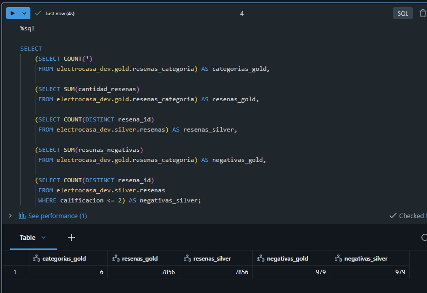

---

## 5. Orquestación con Lakeflow Jobs

El DAG final ejecuta dos notebooks de ingesta y luego el pipeline:

```text
ingesta_productos ─┐
                   ├──> ejecutar_pipeline
ingesta_tracking  ─┘
```

- `ingesta_productos`: Notebook task con COPY INTO.
- `ingesta_tracking`: Notebook task que materializa Azure SQL en Bronze.
- `ejecutar_pipeline`: Pipeline task.
- Reintentos: `max_retries: 2` y `min_retry_interval_millis: 60000`.
- Alertas reales: `on_success` y `on_failure` por correo.

### Evidencia — Job PROD exitoso

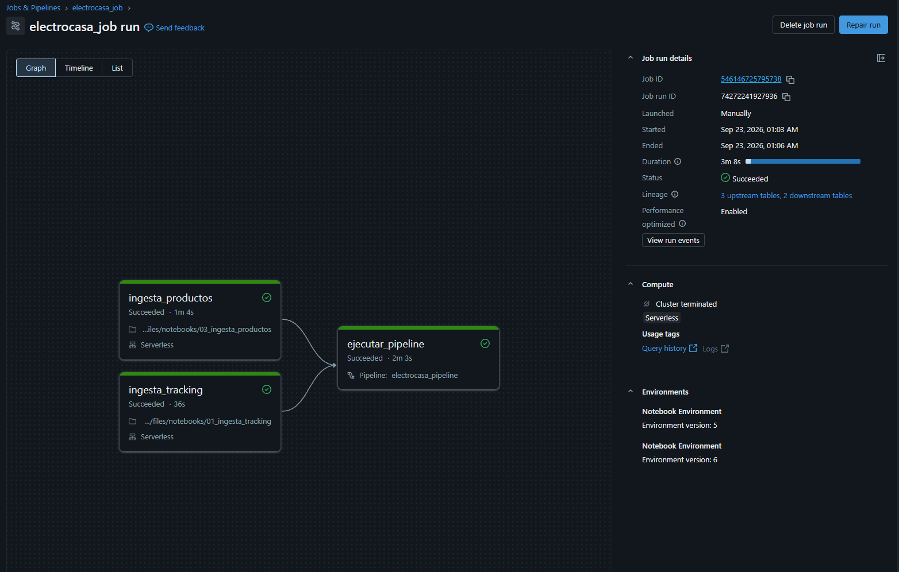

### Trigger

Se configuró un schedule diario a las 08:00 AM, zona `America/Lima`. La configuración fue verificada y luego se dejó `PAUSED` para evitar ejecuciones automáticas durante la entrega.

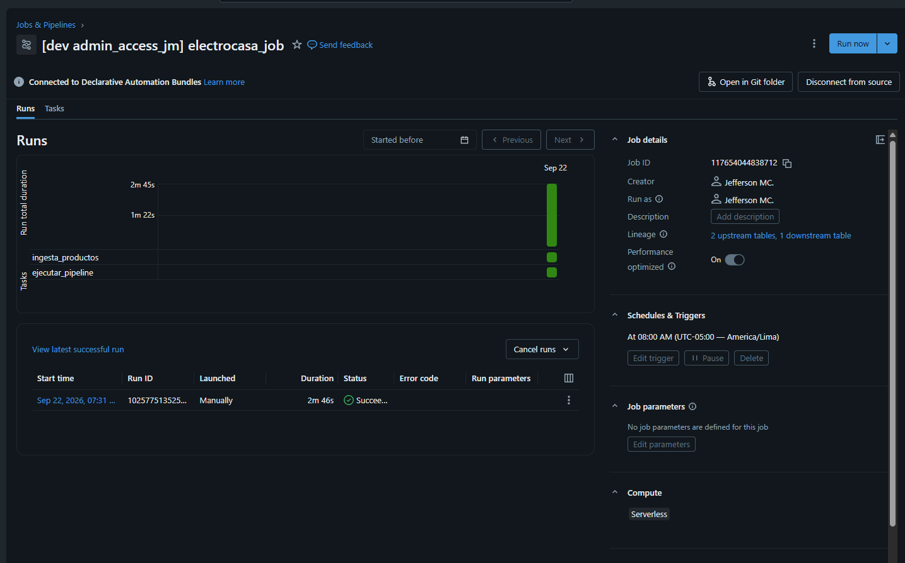

---

## 6. CI/CD con Databricks Asset Bundles

El repositorio usa:

```text
databricks.yml
resources/
├── electrocasa_pipeline.yml
└── electrocasa_job.yml
```

Targets:

```text
dev  → electrocasa_dev
prod → electrocasa_prod
```

Comandos principales:

```bash
databricks bundle validate -t dev
databricks bundle deploy -t dev

databricks bundle validate -t prod
databricks bundle deploy -t prod
databricks bundle run -t prod electrocasa_job
```

Para `prod` se definió `workspace.root_path`, requerido por `mode: production`.

### Evidencia — recursos creados en PROD

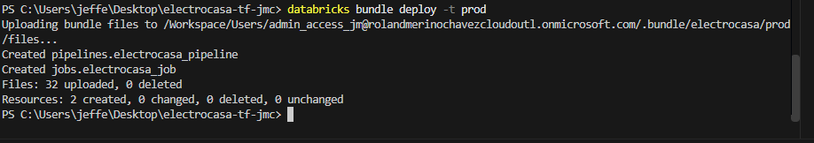

### Validación de datos PROD

La ejecución final cargó datos reales en `electrocasa_prod` y generó Gold correctamente.

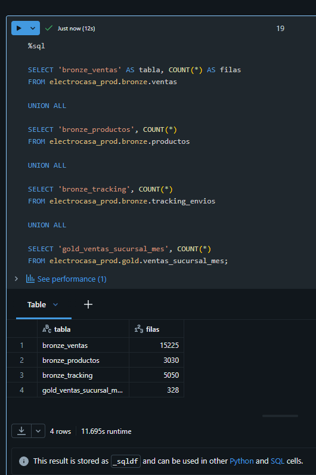

---

## 7. Gobierno y seguridad

Grupos creados:

```text
electrocasa_engineers
electrocasa_analysts
electrocasa_auditors
```

Acceso esperado:

| Grupo | Acceso |
|---|---|
| Engineering | lectura/escritura en Bronze, Silver y Gold |
| Analysts | solo lectura en Gold |
| Auditors | lectura en Gold + evidencia de auditoría/lineage |

Los grupos de cuenta se crearon manualmente en Account Console; `00_setup.ipynb` aplica `GRANT` / `REVOKE` reales sobre Unity Catalog.

### Masking

`dni` y `salario` en `silver.empleados_historial` se enmascaran con `is_account_group_member('electrocasa_engineers')`.

- Fuera de Engineering: `dni = ********`, `salario = NULL`.
- Dentro de Engineering: valores reales.

Evidencia del comportamiento fuera de Engineering:

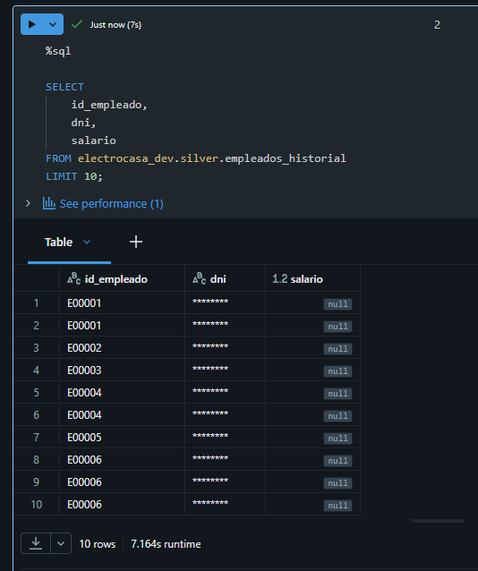

---

## 8. Monitoreo y troubleshooting

Se consulta el Event Log del pipeline desde `09_monitoreo` y se publicó el dashboard `electrocasa_monitoreo`.

Durante el desarrollo, el Event Log permitió identificar dos fallos históricos por `UNSUPPORTED_LIBRARY_FILE_TYPE`: el `glob` del pipeline estaba incluyendo un `.gitkeep` dentro de `transformations/`. Se eliminó el archivo y las siguientes ejecuciones terminaron correctamente.

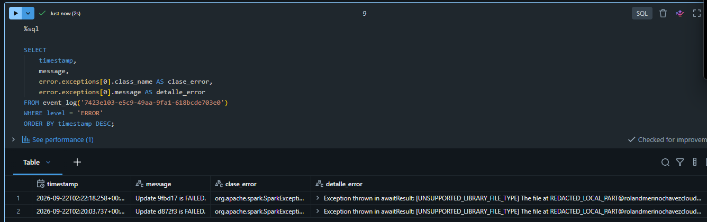

El dashboard resume eventos por nivel, errores registrados y eventos recientes.

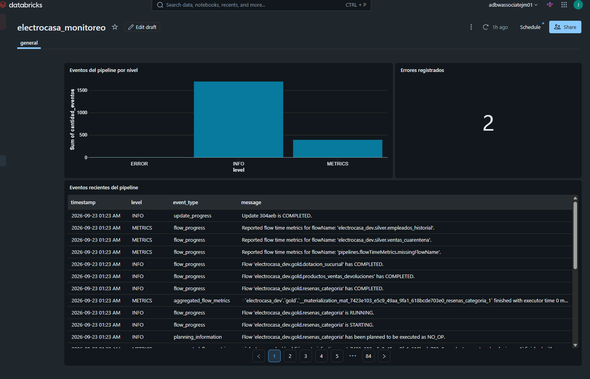

---

## 9. Decisiones técnicas adicionales

### Productos con distintas versiones de precio

Se detectaron 30 `producto_id` reemitidos con distinto precio. Como la fuente no tiene timestamp/versionado que permita saber cuál es la versión más reciente, se conservaron ambas y **no se inventó un orden temporal**. Gold evita duplicaciones agregando antes del join y usando atributos estables.

### Managed File Events

No se usaron porque el entorno Azure no tenía todos los permisos necesarios sobre Event Grid/colas. Se mantuvo Auto Loader con directory listing, suficiente para el bajo volumen del ejercicio.

### Serverless y costos

Se usa Serverless para notebooks, Jobs y Pipeline porque:

- el uso es intermitente;
- evita clusters ociosos;
- simplifica aprovisionamiento/autoscaling;
- la suscripción tenía limitaciones de cuota para compute clásico.

### Retos opcionales

- **Cuarentena:** implementada y consultable con motivo de rechazo; la trazabilidad técnica del registro original se conserva. La variante opcional de trazabilidad enriquecida uniforme en todas las cuarentenas no se presenta como un requisito adicional completado.
- **Metadata-driven ingestion:** no se implementó; las rutas y parámetros se externalizaron mediante variables del Bundle, pero no mediante un archivo de metadata genérico por fuente.

---

## 10. Pasos de despliegue resumidos

1. Ejecutar `00_setup.ipynb` para catálogo, schemas, Volume y permisos.
2. Crear los grupos de cuenta requeridos y validar `GRANT/REVOKE`.
3. Configurar Key Vault / Secret Scope y conexión a Azure SQL.
4. Copiar archivos al landing correspondiente al ambiente.
5. Ejecutar:

```bash
databricks bundle validate -t <target>
databricks bundle deploy -t <target>
databricks bundle run -t <target> electrocasa_job
```

6. Validar tablas Gold, seguridad y monitoreo.

---

## 11. Matriz de cumplimiento

| Requisito | Implementación / evidencia |
|---|---|
| 6 fuentes | Ventas, Productos, Empleados, Reseñas, Devoluciones, Tracking |
| ≥2 métodos de ingesta | Auto Loader, COPY INTO, Lakehouse Federation |
| Bronze / Silver / Gold | Lakeflow Declarative Pipeline |
| Auditoría Bronze | timestamp, origen/archivo, lote |
| Expectation | Ventas, Reseñas y Devoluciones |
| Registros rechazados trazables | tablas de cuarentena |
| Historización empleados | AUTO CDC SCD Tipo 2 |
| ≥3 Gold | 4 tablas Gold implementadas |
| Job con ≥2 task types | Notebook + Pipeline |
| Dependencias reales | ambas ingestas → pipeline |
| Retries y alertas reales | configurados y probados |
| Trigger | schedule 08:00 America/Lima; final PAUSED |
| Bundle | `databricks.yml` + `resources/` |
| 2 targets | `dev` y `prod` |
| Deploy exitoso | ambos targets; ejecución final PROD exitosa |
| Monitoreo | Event Log + dashboard publicado |
| Costos | Serverless justificado |
| 3 grupos | Engineering, Analysts, Auditors |
| GRANT / REVOKE | aplicados en Unity Catalog |
| Masking | DNI y salario |
| Managed vs External | External Volume landing + managed tables |

---

## 12. Estructura principal del repositorio

```text
electrocasa-tf-jmc/
├── databricks.yml
├── README.md
├── docs/
│   └── images/
├── resources/
│   ├── electrocasa_pipeline.yml
│   └── electrocasa_job.yml
├── notebooks/
│   ├── 00_setup.ipynb
│   ├── 01_ingesta_tracking.ipynb
│   ├── 03_ingesta_productos.ipynb
│   ├── 07_validacion_gold.ipynb
│   ├── 08_seguridad.ipynb
│   └── 09_monitoreo.ipynb
└── src/electrocasa/transformations/
    ├── bronze_*.py
    ├── silver_*.py
    ├── scd_empleados.py
    └── gold_*.py
```

---

## Resultado

La solución integra las seis fuentes solicitadas, implementa calidad y cuarentena, historización SCD2, cuatro agregaciones Gold, orquestación real, seguridad, monitoreo y despliegue reproducible en `dev` y `prod`. La ejecución final de producción terminó correctamente y generó datos en Bronze, Silver y Gold.
